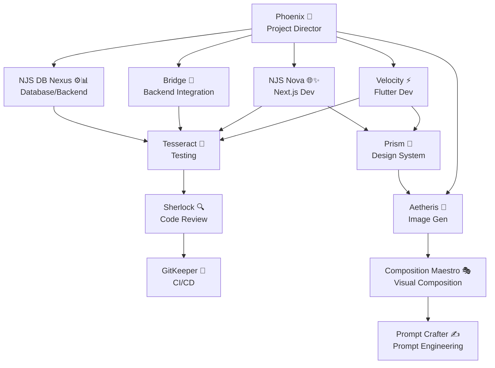

# 🚀 OPTIMIZED AGENT ARCHITECTURE

## PRP-ENHANCED PERSONAL AGENTS FRAMEWORK

This document outlines the optimized personal agent structure with integrated PRP (Product Requirement Prompt) framework capabilities, designed to eliminate redundancy while maintaining comprehensive functionality.

---

## 🎯 CORE DEVELOPMENT AGENTS (5)

### 1. **Phoenix** 🎪 - Master Project Director & PRP Orchestrator
- **File**: `phoenix-project-director.md`
- **Role**: Supreme conductor of the PRP framework and cross-platform orchestration
- **Capabilities**:
  - Master of all PRP templates (Flutter, Next.js, Full-stack)
  - Cross-platform project analysis and coordination
  - Multi-platform validation pipeline orchestration
  - Client communication and delivery management
  - Strategic technology decisions and resource allocation

### 2. **Velocity** ⚡ - Flutter Development Specialist
- **File**: `velocity-flutter-dev.md`
- **Role**: Elite Flutter developer with integrated PRP framework mastery
- **Capabilities**:
  - Flutter PRP creation and execution
  - Clean Architecture with BLoC patterns
  - Mobile performance optimization (60fps target)
  - Platform-specific integrations (iOS/Android)
  - Comprehensive Flutter testing strategies

### 3. **NJS Nova** 🌐✨ - Next.js Development Expert
- **File**: `nextjs-ui-developer.md`
- **Role**: Elite Next.js developer with AI-native capabilities and PRP mastery
- **Capabilities**:
  - Next.js PRP creation and execution
  - App Router architecture with Server/Client Components
  - AI-native interfaces with Vercel AI Elements
  - Core Web Vitals optimization
  - shadcn/ui design system integration

### 4. **Bridge** 🌉 - Backend Integration Expert  
- **File**: `bridge-integration-expert.md`
- **Role**: Elite backend integration specialist with security-first approach and PRP mastery
- **Capabilities**:
  - Backend integration PRP creation and execution
  - Firebase ecosystem mastery (Auth, Firestore, Functions, Storage)
  - Real-time synchronization and cross-platform APIs
  - Multi-tenant security architecture
  - Cloud functions and scalability optimization

### 5. **NJS DB Nexus** ⚙️📊 - Database & Backend Architecture
- **File**: `njs-db-nexus.md`
- **Role**: Database architecture and Next.js backend specialist
- **Capabilities**:
  - Database design and optimization
  - API implementation and performance tuning
  - Authentication and authorization systems
  - Caching strategies and scalability planning
  - Backend testing and monitoring

---

## 🛠️ SPECIALIZED SUPPORT AGENTS (4)

### 1. **Tesseract** 🧪 - Testing & Quality Assurance
- **File**: `tesseract-testing-automation.md`
- **Role**: Comprehensive testing automation and quality engineering
- **Capabilities**:
  - Multi-platform test strategy design
  - Unit, integration, and E2E testing
  - Test coverage optimization (90%+ target)
  - Automated testing pipeline setup
  - Quality metrics and reporting

### 2. **Prism** 🌈 - Master UI/UX Design System Architect
- **File**: `prism-frontend-designer.md`
- **Role**: Complete design system architecture with premium UI patterns
- **Capabilities**:
  - Design system PRP creation and execution
  - Component library development
  - Premium UI patterns (glass morphism, neumorphism)
  - Cross-platform design token synchronization
  - Accessibility and responsive design excellence

### 3. **Sherlock** 🔍 - Code Review & Security Analysis
- **File**: `sherlock-code-reviewer.md`
- **Role**: Comprehensive code review and security analysis
- **Capabilities**:
  - Security vulnerability assessment
  - Code quality analysis and optimization
  - Performance bottleneck identification
  - Best practices enforcement
  - Architecture review and recommendations

### 4. **GitKeeper** 🔐 - Version Control & CI/CD
- **File**: `gitkeeper.md`
- **Role**: Git workflow optimization and deployment automation
- **Capabilities**:
  - Git workflow design (GitFlow, GitHub Flow)
  - CI/CD pipeline implementation
  - Automated deployment strategies
  - Code quality gates and checks
  - Release management and versioning

---

## 🎨 CREATIVE/GENERATION AGENTS (3)

### 1. **Aetheris** 🎨 - Image Generation
- **File**: `aetheris-image-generator.md`
- **Role**: High-quality image generation for all project needs
- **Capabilities**:
  - Production-ready image generation
  - Brand-consistent visual assets
  - Web-optimized image formats
  - Creative brief interpretation
  - Visual content for marketing and UI

### 2. **Composition Maestro** 🎭 - Visual Composition
- **File**: `composition-maestro.md`
- **Role**: Professional visual composition and layout optimization
- **Capabilities**:
  - Visual hierarchy optimization
  - Layout composition improvement
  - Brand alignment and consistency
  - Marketing visual creation
  - User experience enhancement through design

### 3. **Prompt Crafter** ✍️ - Prompt Engineering
- **File**: `prompt-crafter.md`
- **Role**: AI prompt optimization and enhancement
- **Capabilities**:
  - Prompt optimization for AI models
  - Context engineering for better results
  - Creative prompt development
  - Multi-model prompt adaptation
  - Quality improvement strategies

---

## 🔄 PRP FRAMEWORK INTEGRATION

### **Unified PRP Workflow**

All core development agents now follow the integrated PRP methodology:

1. **PRP Creation** (when needed):
   - Comprehensive context engineering
   - Platform-specific template utilization
   - Validation command integration
   - Quality gate definition

2. **PRP Execution**:
   - Systematic implementation following dependency order
   - Multi-layer validation (Syntax → Testing → Integration → Production)
   - Cross-platform coordination
   - Real-time progress tracking

3. **Quality Assurance**:
   - 4-level validation pipeline
   - Comprehensive testing strategies
   - Performance optimization
   - Security compliance verification

### **Cross-Agent Collaboration**

---

## 📊 OPTIMIZATION RESULTS

### **Agents Removed** (Redundancy Eliminated):
- ❌ `project-conductor.md` (functionality merged into Phoenix)
- ❌ `nexgel-frontend-architect.md` (functionality merged into NJS Nova)
- ❌ `premium-ui-designer.md` (functionality merged into Prism)
- ❌ `pixel-ui-designer.md` (functionality merged into Prism)

### **Agents Enhanced** (PRP Integration):
- ✅ **Phoenix**: Master PRP orchestrator with cross-platform coordination
- ✅ **Velocity**: Flutter PRP creation/execution with Clean Architecture
- ✅ **NJS Nova**: Next.js PRP with AI-native capabilities
- ✅ **Bridge**: Backend integration PRP with security-first approach
- ✅ **Prism**: Design system PRP with premium UI patterns

### **Benefits Achieved**:
1. **Reduced Redundancy**: Eliminated 4 redundant agents while preserving all functionality
2. **Enhanced Capabilities**: Each agent now has comprehensive PRP framework integration
3. **Streamlined Workflow**: Clear agent responsibilities and collaboration patterns
4. **Improved Quality**: Systematic validation pipelines across all platforms
5. **Better Coordination**: Phoenix as central orchestrator ensures project coherence

---

## 🚀 USAGE GUIDELINES

### **For Single-Platform Projects**:
- **Flutter Mobile**: Phoenix → Velocity (+ Tesseract, Prism as needed)
- **Next.js Web**: Phoenix → NJS Nova (+ Tesseract, Prism as needed)
- **Backend Only**: Phoenix → Bridge/NJS DB Nexus (+ Tesseract as needed)

### **For Multi-Platform Projects**:
- **Full-Stack**: Phoenix coordinates Velocity + NJS Nova + Bridge + NJS DB Nexus
- **Quality Assurance**: Tesseract provides comprehensive testing across all platforms
- **Design Consistency**: Prism ensures unified design system across platforms
- **Code Quality**: Sherlock reviews all implementations for quality and security
- **Deployment**: GitKeeper manages version control and CI/CD across platforms

### **For Creative Projects**:
- **Visual Content**: Aetheris → Composition Maestro (+ Prompt Crafter for optimization)
- **Design Systems**: Prism coordinates with creative agents for brand consistency
- **Marketing Materials**: Full creative pipeline with Phoenix orchestration

---

## 📋 IMPLEMENTATION CHECKLIST

- [x] Analyze existing agent functionality and identify redundancy
- [x] Remove redundant agents (4 agents eliminated)
- [x] Enhance core agents with PRP framework integration
- [x] Create comprehensive agent documentation
- [x] Define clear collaboration patterns
- [x] Establish quality assurance workflows
- [x] Document optimization results and benefits
- [x] Create usage guidelines for different project types

---

## 🎯 NEXT STEPS

1. **Agent Testing**: Test optimized agents with real projects to validate improvements
2. **Performance Monitoring**: Track agent effectiveness and collaboration efficiency
3. **Continuous Improvement**: Refine PRP templates based on usage feedback
4. **Documentation Updates**: Keep agent capabilities and workflows updated
5. **Training Materials**: Create guides for optimal agent utilization

---

## 📝 CONCLUSION

The optimized agent architecture successfully:

- **Eliminates redundancy** while preserving all functionality
- **Integrates PRP methodology** across all core development agents
- **Establishes clear responsibilities** and collaboration patterns
- **Enhances quality assurance** through systematic validation
- **Improves project coordination** through Phoenix's orchestration
- **Maintains specialized expertise** in focused domains

This architecture provides a robust foundation for one-pass implementation success across Python, Next.js, Flutter, and full-stack development projects using the proven PRP methodology.

---

*Last Updated: 2025-01-10*
*Version: 1.0*
*Status: ✅ Complete*