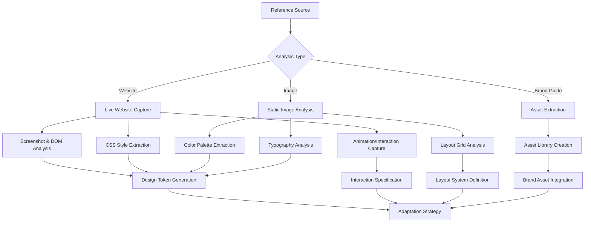
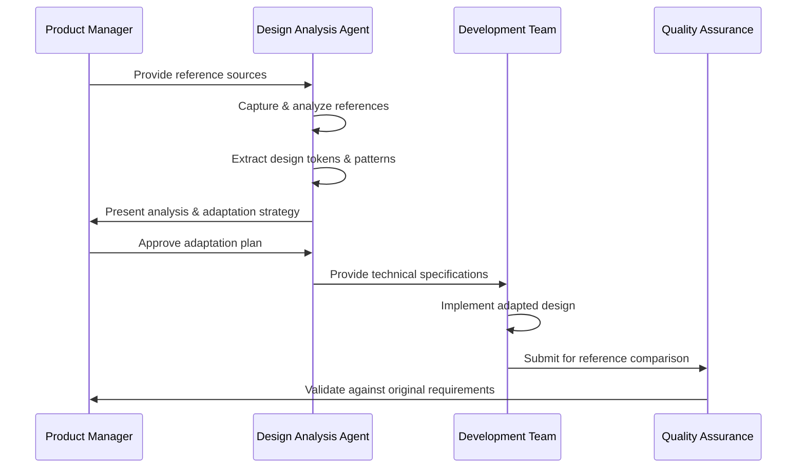

name: "Planning PRP Template - PRD Generation with Diagrams"
description: |

## Purpose
Generate comprehensive Product Requirements Documents (PRDs) with visual diagrams, turning rough ideas into detailed specifications ready for implementation PRPs.

## Philosophy
1. **Research First**: Gather context before planning
2. **Visual Thinking**: Use diagrams to clarify concepts
3. **Validation Built-in**: Include challenges and edge cases
4. **Implementation Ready**: Output feeds directly into other PRPs

---

## Initial Concept
$ARGUMENTS

## Recommended Skills for This PRP

> **Reference**: See `skills-ecosystem/prp-skill-maps/SKILL-PRP-MAPPING.md` for full mapping.

```yaml
# Planning PRP skills - research and architecture focus
skills_context:
  architecture: # For system visualization
    recommended:
      - eraser-diagrams           # Architecture diagrams from code/descriptions

  business: # For business-driven planning
    recommended:
      - pricing-strategy          # Pricing tiers, packaging, monetization
      - finance-expert            # Financial systems, FinTech

  design_research: # For design-driven planning
    recommended:
      - ui-ux-pro-max             # Design system planning
      - brand-typography-systems  # Brand typography framework
      - web-design-guidelines     # Compliance requirements

  content_strategy:
    recommended:
      - human-writing             # Content strategy, tone
      - social-content            # Social media planning
      - seo-audit                 # SEO strategy
```

## Design Reference Analysis & Reproduction

### Reference-Based Design Requirements

When creating products that need to reference or reproduce existing designs/websites, include this comprehensive analysis:

#### Reference Identification
```yaml
reference_sources:
  websites:
    - url: "https://example.com"
      purpose: "Main design inspiration"
      focus_areas: [layout, color_scheme, typography, animations]
    - url: "https://another-site.com" 
      purpose: "Component reference"
      focus_areas: [buttons, forms, navigation]
  
  design_assets:
    - image_path: "./references/design-mockup.png"
      type: "mockup"
      extraction_needed: [dimensions, spacing, colors, fonts]
    - image_path: "./references/component-library.jpg"
      type: "component_reference"
      extraction_needed: [interaction_patterns, visual_hierarchy]
  
  brand_references:
    - source: "Brand guidelines document"
      elements: [logo_usage, color_palette, typography, iconography]
```

#### Visual Element Extraction Strategy


#### Reference Analysis Process
```markdown
## Design Reference Breakdown

### Visual Hierarchy Analysis
- **Layout Structure**: [Grid system, containers, breakpoints]
- **Typography Scale**: [Heading hierarchy, body text, font families]
- **Color System**: [Primary, secondary, accent colors, gradients]
- **Spacing System**: [Margins, paddings, gaps, consistent spacing scale]
- **Component Patterns**: [Cards, buttons, forms, navigation elements]

### Interaction & Animation Analysis
- **Micro-interactions**: [Hover states, click feedback, loading states]
- **Page Transitions**: [Route changes, modal appearances, sliding effects]
- **Scroll Behaviors**: [Parallax, sticky elements, reveal animations]
- **Responsive Behaviors**: [Mobile adaptations, breakpoint changes]

### Technical Implementation Extraction
\```yaml
extracted_specifications:
  css_framework: [tailwind, bootstrap, custom]
  javascript_libraries: [react, vue, vanilla]
  animation_libraries: [framer-motion, gsap, css-animations]
  responsive_strategy: [mobile-first, desktop-first, fluid]
  
  design_tokens:
    colors:
      primary: "#hexvalue"
      secondary: "#hexvalue"
      accent: "#hexvalue"
    
    typography:
      heading: "Font Family"
      body: "Font Family"
      sizes: [scale values]
    
    spacing:
      scale: [4px, 8px, 16px, 24px, 32px, 48px, 64px]
    
    breakpoints:
      mobile: "480px"
      tablet: "768px" 
      desktop: "1024px"
      wide: "1280px"
\```
```

#### Adaptation Strategy
```markdown
## Reference Adaptation Plan

### What to Preserve
- [ ] Core visual identity elements that align with project goals
- [ ] Successful UX patterns and user flows
- [ ] Effective color schemes and typography combinations
- [ ] Proven component interaction patterns

### What to Modify
- [ ] Brand-specific elements (colors, fonts, logos)
- [ ] Content structure to match project requirements
- [ ] Component sizing and proportions for new use case
- [ ] Navigation structure and information architecture

### What to Enhance
- [ ] Accessibility improvements (WCAG compliance)
- [ ] Performance optimizations (image formats, loading strategies)
- [ ] Mobile responsiveness enhancements
- [ ] Modern web standards and best practices

### Custom Adaptations
- [ ] Project-specific features not in reference
- [ ] Brand alignment modifications
- [ ] Technical stack adaptations
- [ ] Performance and SEO optimizations
```

#### Reference Integration Workflow


### Agent Assignment for Reference Analysis
```yaml
primary_agent: "design-review-agent"
capabilities_needed:
  - Website screenshot and DOM analysis
  - CSS style extraction and interpretation
  - Animation and interaction capture
  - Design token generation
  - Cross-browser compatibility validation
  - Accessibility compliance checking

supporting_agents:
  - "composition-maestro": Visual balance and hierarchy analysis
  - "prism-frontend-designer": Design system integration
  - "aetheris-image-generator": Asset recreation when needed

tools_required:
  - Playwright MCP: Live website capture and analysis
  - Unsplash MCP: Stock photo replacements when needed
  - Browser automation for responsive testing
```

## Planning Process

### Phase 1: Idea Expansion & Research

#### Context Gathering
```yaml
research_areas:
  market_analysis:
    - competitors: [Research similar solutions]
    - user_needs: [Identify pain points]
    - trends: [Current industry directions]
  
  technical_research:
    - existing_solutions: [How others solve this]
    - libraries: [Available tools/frameworks]
    - patterns: [Common implementation approaches]
  
  internal_context:
    - current_system: [How it works today]
    - constraints: [Technical/business limitations]
    - integration_points: [What it must work with]
```

#### Initial Exploration
```
RESEARCH similar solutions:
  - WEB_SEARCH: "{concept} implementation examples"
  - WEB_SEARCH: "{concept} best practices"
  - WEB_SEARCH: "{concept} architecture patterns"

ANALYZE existing codebase:
  - FIND: Similar features already implemented
  - IDENTIFY: Patterns to follow
  - NOTE: Technical constraints
```

### Phase 2: PRD Structure Generation

#### 1. Executive Summary
```markdown
## Problem Statement
[Clear articulation of the problem being solved]

## Solution Overview
[High-level description of proposed solution]

## Success Metrics
- Metric 1: [Measurable outcome]
- Metric 2: [Measurable outcome]
- KPI: [Key performance indicator]
```

#### 2. User Stories & Scenarios
```markdown
## Primary User Flow
\```mermaid
graph LR
    A[User Action] --> B{Decision Point}
    B -->|Path 1| C[Outcome 1]
    B -->|Path 2| D[Outcome 2]
    D --> E[Final State]
    C --> E
\```

## User Stories
1. **As a [user type]**, I want to [action] so that [benefit]
   - Acceptance Criteria:
     - [ ] Criterion 1
     - [ ] Criterion 2
   - Edge Cases:
     - [Edge case 1]
     - [Edge case 2]
```

#### 3. System Architecture
```markdown
## High-Level Architecture
\```mermaid
graph TB
    subgraph "Frontend"
        UI[User Interface]
        State[State Management]
    end
    
    subgraph "Backend"
        API[API Layer]
        BL[Business Logic]
        DB[(Database)]
    end
    
    subgraph "External"
        EXT[External Services]
    end
    
    UI --> API
    API --> BL
    BL --> DB
    BL --> EXT
    State --> UI
\```

## Component Breakdown
- **Frontend Components**:
  - [Component 1]: [Purpose]
  - [Component 2]: [Purpose]

- **Backend Services**:
  - [Service 1]: [Purpose]
  - [Service 2]: [Purpose]

- **Data Models**:
  - [Model 1]: [Fields and relationships]
  - [Model 2]: [Fields and relationships]
```

#### 4. Technical Specifications
```markdown
## API Design
\```mermaid
sequenceDiagram
    participant U as User
    participant F as Frontend
    participant A as API
    participant D as Database
    participant E as External Service
    
    U->>F: Initiates Action
    F->>A: POST /api/endpoint
    A->>D: Query Data
    D-->>A: Return Data
    A->>E: Call External API
    E-->>A: Response
    A-->>F: Processed Result
    F-->>U: Display Result
\```

## Endpoints
- **POST /api/[resource]**
  - Request: `{field1: type, field2: type}`
  - Response: `{status: string, data: {...}}`
  - Errors: `400 Bad Request`, `401 Unauthorized`

## Data Flow
\```mermaid
flowchart TD
    A[Input Data] --> B{Validation}
    B -->|Valid| C[Processing]
    B -->|Invalid| D[Error Response]
    C --> E[Transform]
    E --> F[Store]
    F --> G[Return Success]
\```
```

#### 5. Implementation Strategy
```markdown
## Development Phases
\```mermaid
graph LR
    A[Foundation] --> B[Core Features]
    B --> C[Integration]
    C --> D[Testing]
    D --> E[Deployment]
    
    A -.- F[Database Schema<br/>API Framework<br/>Authentication]
    B -.- G[Business Logic<br/>API Endpoints<br/>Basic UI]
    C -.- H[External Services<br/>Full UI Integration<br/>Error Handling]
    D -.- I[Unit Tests<br/>Integration Tests<br/>Performance Tests]
    E -.- J[Documentation<br/>Monitoring<br/>Launch]
\```

## Implementation Priority
1. **Foundation**: Core infrastructure and setup
2. **MVP Features**: Minimum viable functionality
3. **Enhanced Features**: Additional capabilities
4. **Polish**: Performance, UX improvements
5. **Production Ready**: Full testing and deployment
```

### Phase 3: Challenge & Validation

#### Devil's Advocate Analysis
```yaml
challenges:
  technical_risks:
    - risk: "Performance at scale"
      mitigation: "Implement caching layer"
    
    - risk: "Third-party API reliability"
      mitigation: "Build fallback mechanisms"
  
  business_risks:
    - risk: "User adoption"
      mitigation: "Phased rollout with feedback loops"
    
    - risk: "Scope creep"
      mitigation: "Strict MVP definition"
  
  edge_cases:
    - scenario: "No network connectivity"
      handling: "Offline mode with sync"
    
    - scenario: "Concurrent updates"
      handling: "Optimistic locking"
```

#### Success Criteria
```markdown
## Definition of Done
- [ ] All user stories implemented
- [ ] Test coverage > 80%
- [ ] Performance benchmarks met
- [ ] Security review passed
- [ ] Documentation complete

## Measurable Outcomes
- Metric 1: [Target value]
- Metric 2: [Target value]
- User satisfaction: [Target score]
```

### Phase 4: Validation & Output

#### Pre-Implementation Checklist
```
VALIDATE assumptions:
  - Technical feasibility confirmed
  - Resource availability verified
  - Dependencies identified
  - Risks documented with mitigations

REVIEW with stakeholders:
  - Business alignment confirmed
  - Technical approach approved
  - Timeline acceptable
  - Success metrics agreed
```

#### Output Format
The final PRD should be structured as:

1. **Executive Summary** (1 page)
2. **Detailed Requirements** (with diagrams)
3. **Technical Architecture** (with diagrams)
4. **Implementation Plan** (with timeline)
5. **Appendices** (research, alternatives considered)

### Validation Commands

```bash
# Verify PRD completeness
grep -E "(TODO|TBD|FIXME)" generated_prd.md

# Check diagram syntax
mermaid-cli -i generated_prd.md -o prd_diagrams.pdf

# Validate structure
python validate_prd_structure.py generated_prd.md
```

## Anti-Patterns to Avoid
- ❌ Vague requirements without acceptance criteria
- ❌ Missing edge cases and error scenarios
- ❌ Diagrams that don't match the text
- ❌ Technical jargon without explanation
- ❌ Unrealistic timelines
- ❌ No success metrics

## Success Indicators
- ✅ Another developer could implement from this PRD alone
- ✅ All stakeholders understand the plan
- ✅ Risks are identified with mitigations
- ✅ Clear path from current state to desired state
- ✅ Diagrams clarify rather than confuse

## Template Usage Example

Input: "Build a notification system for our app"

Output would include:
- User flow diagrams for different notification types
- System architecture showing pub/sub patterns
- Sequence diagrams for real-time delivery
- Database schema for notification preferences
- API specifications for notification endpoints
- Implementation phases and priorities
- Edge cases like offline users, rate limiting
- Success metrics like delivery rate, user engagement

The resulting PRD becomes the `$ARGUMENTS` input for implementation PRPs like BASE_PRP or SPEC_PRP.